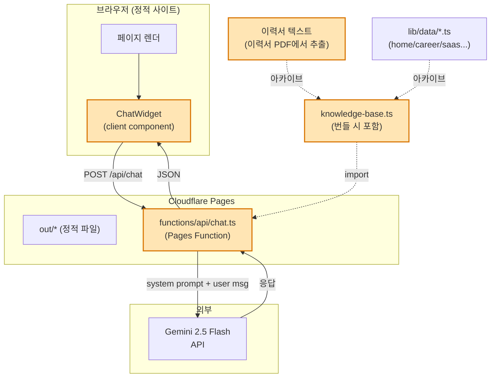
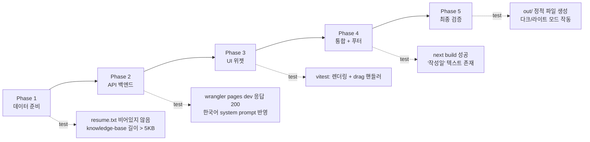
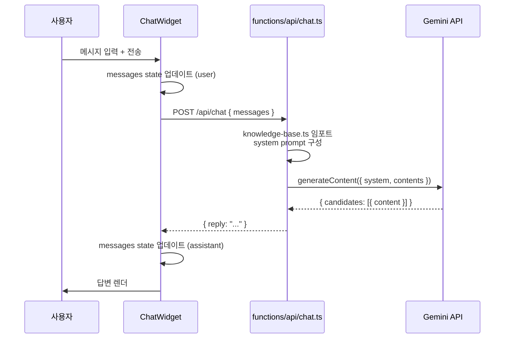

# AI Chat Widget — 상세 설계

## 0. 목표 (Goals)

1. **좌하단 AI 채팅 위젯**: 사이트 콘텐츠 + 정인수 이력서 데이터만 기반으로 한국어 답변
2. **모델**: `gemini-2.5-flash` (입력 $0.30/1M · 출력 $2.50/1M, 2026 기준 가성비 최상)
3. **DB 없음**: 정적 텍스트 통합 → 시스템 프롬프트 주입 (수십 KB 규모)
4. **모바일 UX**: 좌측 슬라이드 인 (66.67vw) + 좌측 드래그로 닫기
5. **데스크톱 UX**: 좌하단 380×600 고정 패널
6. **아이콘**: 캐릭터 보류 → 말풍선 SVG로 우선 진행 (추후 사용자 캐릭터 교체)
7. **푸터**: '작성일: 2026. 5. 5.' 작은 글씨 추가

## 1. 제약 (Constraints)

- **commit/PR/deploy 없음**: 로컬 feature branch (`feat/chat-widget`)에서 Phase별 스냅샷 commit만. main 영향 0.
- **롤백 가능**: `git reset --hard pre-chat-widget` 또는 `git checkout main`으로 즉시 복원
- **Static export 유지**: `output: "export"` 그대로. API는 Cloudflare Pages Functions로 분리
- **Next.js 16 + React 19 컨벤션 유지**
- **shadcn/ui 우선**: 새 UI 원시 컴포넌트는 shadcn/ui 미존재 시에만

## 2. 아키텍처 (Mermaid)



## 3. 구현 로드맵 (Mermaid)



## 4. 데이터 플로우 (Mermaid)



## 5. Phase별 상세

### Phase 1: 데이터 준비

**파일**:
- `scripts/extract-resume-text.ts` — pdf-to-img은 이미지 추출용. **pdfjs-dist** 사용 (Next 16에 trans 의존). 없으면 `pdf-parse` 1회 설치 후 추출. 결과 → `lib/data/resume.txt`
- `lib/data/knowledge-base.ts` — 모든 lib/data/*.ts 임포트 + resume.txt 임베드 → 단일 KNOWLEDGE_BASE 문자열
- `tests/knowledge-base.test.ts` — knowledge-base 길이 체크, 핵심 키워드 ('정인수', 'Vibe Coding', '17년') 포함 검증

**검증**:
- `pnpm test tests/knowledge-base.test.ts` 통과
- `lib/data/resume.txt` UTF-8 한국어 정상

**리스크**:
- pdf-parse 한국어 추출 실패 가능 → 실패 시 fallback: 사용자에게 텍스트 직접 붙여넣기 요청 OR pdfjs-dist로 재시도

### Phase 2: API 백엔드 (Cloudflare Pages Function)

**파일**:
- `functions/api/chat.ts` — Cloudflare Pages Function. POST /api/chat, JSON body { messages: [{ role, content }] }
  - 환경변수 `GEMINI_API_KEY` 사용 (`env.GEMINI_API_KEY` from PagesFunction context)
  - Gemini REST API 직접 호출 (npm 의존성 0, edge runtime 호환)
  - System prompt = 한국어 페르소나 + KNOWLEDGE_BASE 임베드
  - 에러 처리 + rate limit 안내
- `.dev.vars` (.gitignore 추가) — 로컬 테스트용 GEMINI_API_KEY
- `tests/api-chat.test.ts` — 핸들러 단위 테스트 (mock fetch)

**검증**:
- `pnpm dlx wrangler pages dev out --compatibility-date=2025-01-01` 실행 후 curl 테스트
- 한국어 응답, 사이트 정보 기반 답변
- 키 누락 시 명확한 에러

**Gemini API 호출 형식**:
```
POST https://generativelanguage.googleapis.com/v1beta/models/gemini-2.5-flash:generateContent
?key=${GEMINI_API_KEY}
body: {
  systemInstruction: { parts: [{ text: SYSTEM_PROMPT }] },
  contents: [...messages]
}
```

### Phase 3: UI 위젯

**파일**:
- `components/chat/chat-widget.tsx` — 메인. `"use client"`, framer-motion, useMediaQuery
- `components/chat/chat-message.tsx` — 메시지 버블 (user/assistant)
- `components/chat/chat-bubble-icon.tsx` — 말풍선 SVG 아이콘 (Lucide `MessageCircle` 활용 + 사이트 톤 styling)

**디자인**:
- FAB: `bottom-6 left-6 md:bottom-10 md:left-10`, `w-14 h-14`, `bg-[var(--accent)]`, `z-50` (ScrollToTop은 z-40)
- 데스크톱 패널: `bottom-24 left-6 md:left-10`, `w-[380px] h-[600px]`, `bg-[var(--bg)]`, `border border-[var(--line)]`, `shadow-2xl`, `rounded-2xl`
- 모바일 패널: 좌측 fullheight, `w-2/3` (66.67vw), 슬라이드 인 (`x: -100% → 0`)
- 모바일 닫기: `drag="x"`, `dragConstraints={{ left: -1000, right: 0 }}`, `onDragEnd` threshold (-100px) 시 닫힘

**상태**:
- `messages: Array<{ role: 'user' | 'assistant', content: string }>`
- `input: string`
- `loading: boolean`
- `open: boolean`

**검증**:
- `tests/chat-widget.test.tsx` — vitest + @testing-library/react: 렌더, 클릭 → open, 메시지 추가
- 빌드 성공 (TS 통과)

### Phase 4: 통합 + 푸터

**파일**:
- `app/layout.tsx` — `<ChatWidget />` 마운트 (`<ScrollToTop />` 위에)
- `components/layout/footer.tsx` — '작성일: 2026. 5. 5.' 작은 글씨 추가

**Footer 디자인**:
```tsx
<footer>
  <div>...정인수 / AI Builder · 마케터...</div>
  <div className="mt-2 text-center text-[11px] opacity-40 font-mono">작성일: 2026. 5. 5.</div>
</footer>
```

**검증**:
- 빌드 성공
- '작성일: 2026. 5. 5.' 문자열 정적 HTML에 포함

### Phase 5: 최종 검증

- `pnpm build` — 정적 export 21 라우트 생성
- `out/` 디렉토리 검사 — index.html에 위젯 마운트, footer 텍스트 포함
- 다크/라이트 모드 양쪽 토큰 적용 확인 (개발 서버에서)
- 모바일/데스크톱 미디어쿼리 분기 확인

## 6. 테스트 매트릭스

| Phase | 종류 | 도구 | 커맨드 |
|---|---|---|---|
| 1 | 단위 | vitest | `pnpm test tests/knowledge-base.test.ts` |
| 2 | 단위 | vitest (mock fetch) | `pnpm test tests/api-chat.test.ts` |
| 2 | 통합 | wrangler dev + curl | (수동 1회) |
| 3 | 컴포넌트 | vitest + RTL | `pnpm test tests/chat-widget.test.tsx` |
| 4 | 빌드 | next build | `pnpm build` |
| 5 | 정적 검사 | grep + ls | `grep -r "작성일" out/` |

## 7. 롤백 전략 (Rollback)

**시점**: Phase 진입 전 / 사용자 이슈 보고 시

**방법**:
1. **전체 되돌리기**: `git reset --hard pre-chat-widget` → 원본 main HEAD로 복원
2. **main으로 그냥 떠나기**: `git checkout main` → 작업 브랜치 그대로 보존, main에는 영향 없음
3. **특정 Phase로 되돌리기**: `git log --oneline feat/chat-widget` 후 `git reset --hard <commit>`

**디버그 필요 시**: 작업 브랜치 (`feat/chat-widget`) 그대로 두고 main으로 이동만 해도 라이브 사이트 안전.

## 8. 환경변수 설정 (사용자 액션 필요)

**Phase 5 후**, 실제 사용을 위해:

1. **Google AI Studio**에서 Gemini API 키 발급: https://aistudio.google.com/apikey
2. **로컬 테스트용** (`.dev.vars` 파일에 자동 안내):
   ```
   GEMINI_API_KEY=받은키
   ```
3. **프로덕션** (Cloudflare 대시보드):
   - Pages → junginsu-portfolio → Settings → Environment variables
   - Production: `GEMINI_API_KEY` = 받은키 추가

## 9. 미해결 사항 / Phase 진행 중 결정 필요

- **Functions 배포 경로**: `wrangler pages deploy out`이 프로젝트 루트의 `functions/`를 자동 인식하는지 vs `--functions` 플래그 필요한지 → Phase 2 통합 테스트에서 확정
- **이력서 PDF 추출 라이브러리 선택**: pdf-parse (간단/구버전) vs pdfjs-dist (현대/Next.js 호환) → Phase 1에서 시도 후 결정

## 10. Phase 종료 기준 (DOD)

각 Phase는 다음을 모두 만족할 때 완료:
1. 해당 Phase 산출물 파일 생성/수정 완료
2. 해당 Phase 테스트 모두 통과
3. 로컬 commit (스냅샷) 완료
4. 다음 Phase로 자동 진입

## 11. 2026-05-06 운영 동기화

현재 운영 구현은 초기 설계의 "말풍선 SVG 아이콘" 단계에서 사용자 제공 캐릭터 기반 위젯으로 변경되었다.

**캐릭터 자산**
- 원본: `Character image/character-walking-slowly/character-walking-slowly/autosprite-blink.png`
- 배포 자산: `public/characters/autosprite-blink.png`
- 렌더러: `components/chat/walking-character.tsx`
- atlas: 5x5, 25프레임, 1280x1280 PNG를 CSS background-position으로 재생

**채팅 트리거 동작**
- 위치: 전역 `app/layout.tsx`의 `<ChatWidget />`, 모든 페이지 좌하단 노출
- 크기: 데스크톱 128px, 모바일 100px
- 이동: 하단에서 왼쪽 끝과 오른쪽 끝을 `linear` 왕복. 랜덤 이동/중간 정지 제거
- 방향: 좌→우 이동 중 오른쪽 방향 유지, 우측 끝에서만 반전, 우→좌 이동 중 왼쪽 방향 유지
- 말풍선: 캐릭터 위에 8초 주기로 `무엇이든 물어보세요^^` 표시. 말풍선은 캐릭터 좌우 반전에 영향받지 않음
- 접근성: `prefers-reduced-motion: reduce`에서는 이동과 말풍선 반복 애니메이션을 정지

**채팅 메시지**
- 초기 인사말은 자연스러운 줄바꿈으로 표시
- assistant markdown paragraph에 `whitespace-pre-line` 적용

**모바일 홈 CTA**
- `components/home/cta.tsx`는 `min-h-[42vh]`, 충분한 상하 padding, 모바일 안전 폰트 크기 적용
- `한 사람, 두 면` 섹션과 `9843ohs@gmail.com` CTA가 모바일에서 겹치지 않도록 독립 구간으로 분리

**검증 커맨드**
- `pnpm test -- --runInBand`
- `pnpm build`
- Playwright 수동 확인: 데스크톱 캐릭터 이동/말풍선, 모바일 CTA 간격

**배포**
- GitHub main merge 후 Cloudflare Pages 직접 배포 경로 확인됨:
  `pnpm dlx wrangler pages deploy out --project-name junginsu-portfolio`
